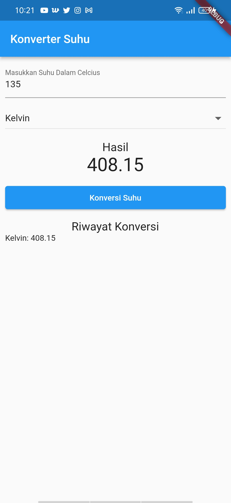

# KONVERSI SUHU LIST

Nama : Aliyah Hanun S

NIM : 1941720175

Kelas : TI 3C

## 1. Tampilan Awal

## 2. Tampilan input (hanya bisa input number)

## 3. Tampilan setelah konversi celcius ke kelvin tersimpan dalam riwayat konversi

## 4. Tampilan setelah konversi celcius ke reamur tersimpan dalam riwayat konversi

## 5. Tampilan setelah konversi celcius ke fahrenheit tersimpan dalam riwayat konversi
